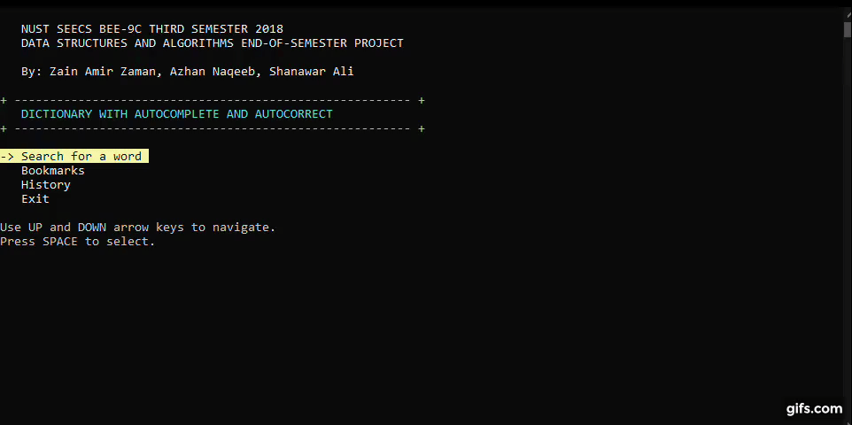
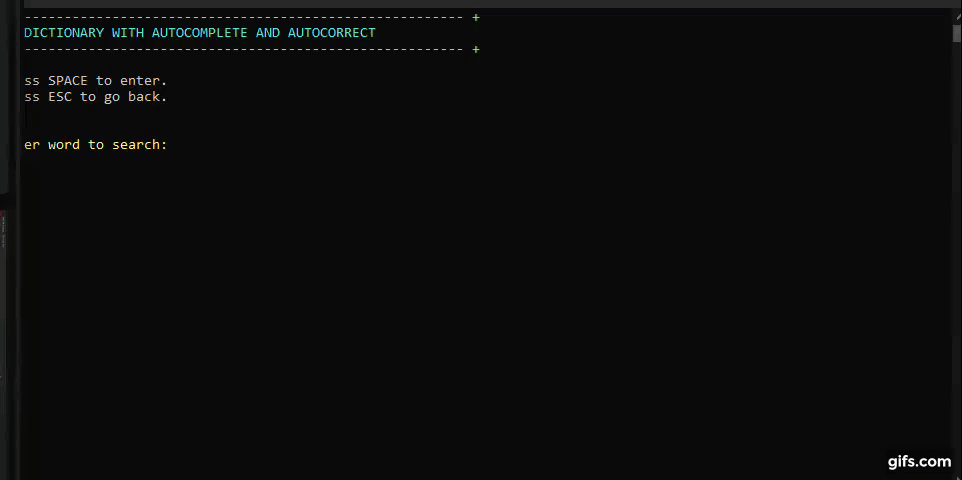

# English Dictionary in C++ with Autocomplete and Autocorrect

This is a project I made for my Data Structures and Algorithms course during my undergraduate EE program. The dictionary contents stored in <code>EnglishDictionary.txt</code> are first loaded into the memory when the program is launched and re-organised into a hash table. For autocomplete and autocorrect, the contents are separately loaded into a [Trie](https://www.geeksforgeeks.org/trie-insert-and-search/).

 

  
  Main menu and word entry

 

 

  

 

Date of creation: December 2018  
Type of project: Semester project  
Group members: Zain Amir Zaman, Azhan Naqeeb, Shanawar Ali
